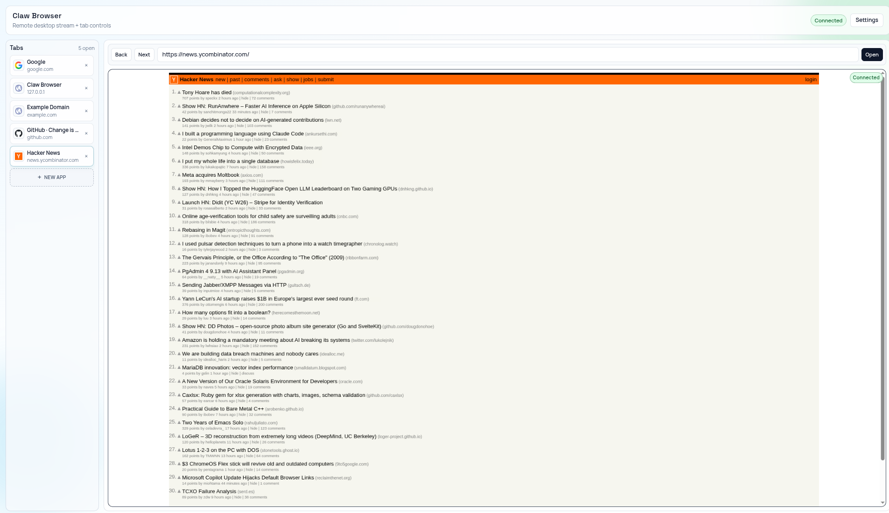
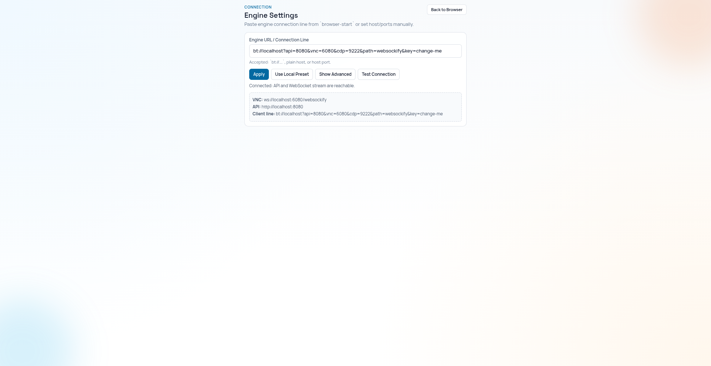

# Claw Browser

A browser runtime for AI agents and owners to collaborate in one persistent live session.

When an agent gets blocked by CAPTCHA, OAuth login, native UI friction, or anti-bot checks, the owner can step in, complete that step, and hand control back without losing browser state.

## Setup and Run

Claw Browser is script-first. No `docker compose`, no `npm run dev`.

### Prerequisites

- Docker
- Bash
- `openssl`

### Quick Start

```bash
# 1) Clone
git clone https://github.com/SarveshPatkr/claw-browser.git
cd claw-browser

# 2) Create local secrets (required)
echo "VNC_PASSWORD=$(openssl rand -base64 16)" >> .env
echo "API_KEY=$(openssl rand -hex 32)" >> .env

# 3) Start everything with one command
./scripts/start.sh
```

What `./scripts/start.sh` does:
- Builds/starts the engine container
- Auto-starts the client server on port `3000`
- Prints a ready-to-paste `bt://...` connection line

After startup:
1. Open `http://localhost:3000`
2. Click `Settings`
3. Paste the printed `bt://...` line
4. Click `Apply`, then `Test Connection`

Stop everything:

```bash
./scripts/stop.sh
```

## Screenshots

Captured from a live session using only `./scripts/browser-cmd.sh`.

Main dashboard (connected stream + multiple tabs):



Settings page (connection line + health check):



## Why This Exists

Most browser-agent stacks break at human-gated steps:
- CAPTCHA and risk checks
- OAuth and Google/Microsoft login prompts
- Native-style clicks/menus and brittle UI transitions
- Sensitive flows where credentials should not be handed to the agent

Claw Browser solves this with:
- Agent control via CLI (`browser-cmd`)
- Human takeover via live UI + VNC stream
- Shared continuity so both act on the same browser state

## Why Agents + Owners Like It

- Agents keep momentum with scriptable tab control and structured page state.
- Owners keep control over sensitive actions (login, 2FA, CAPTCHA, payment confirms).
- Teams avoid credential-sharing anti-patterns and still unblock hard flows quickly.
- Sessions stay persistent, so handoff does not reset context.

## Built for OpenClaw-Style Workflows

If you follow OpenClaw and want the same human-in-the-loop reliability in browser tasks, Claw Browser is built for that exact workflow.

OpenClaw docs recommend manual login in the host browser and warn against giving model credentials. Claw Browser follows the same practical model: agent does most of the flow, human handles gated steps, agent resumes.

- OpenClaw browser login guidance: https://docs.openclaw.ai/tools/browser-login
- OpenClaw overview: https://docs.openclaw.ai/

Many OpenClaw users run browsers on Linux VMs for long-lived sessions. Claw Browser is designed for that same self-hosted Linux VM style.

## When Claw Browser Is The Best Fit

Use it when you need:
- Human takeover without losing agent context
- A persistent remote browser session across many tasks
- CLI-driven automation that an agent can execute directly
- Local/self-hosted control instead of managed browser infrastructure

## Agent Workflow (Recommended)

1. `./scripts/browser-cmd.sh ls` to get tab IDs
2. `./scripts/browser-cmd.sh st --tab <ID>` to inspect page state
3. `./scripts/browser-cmd.sh clk <target> --tab <ID>` to interact
4. Re-run `st` and continue

If blocked, owner unblocks in UI and the agent continues in the same session.

## Common Commands

```bash
./scripts/browser-cmd.sh ls
./scripts/browser-cmd.sh nw https://example.com
./scripts/browser-cmd.sh st --tab <ID>
./scripts/browser-cmd.sh st --agent --tab <ID>
./scripts/browser-cmd.sh clk 1 --tab <ID>
./scripts/browser-cmd.sh in 0 "hello" --tab <ID>
./scripts/browser-cmd.sh scr --stdout --tab <ID>
```

## Do I Need Global Install?

No. Global install is optional convenience.

Without global install, agents can always use local scripts:

```bash
./scripts/browser-cmd.sh ls
./scripts/browser-cmd.sh nw https://example.com
./scripts/browser-cmd.sh st --tab <ID>
```

Optional global aliases:

```bash
sudo ./scripts/install-global-commands.sh

# Then these work globally:
browser-cmd
browser-start
browser-stop
browser-info
```

## Client Server Controls

```bash
./scripts/serve-client.sh --status
./scripts/serve-client.sh --stop
./scripts/serve-client.sh --ensure --daemon --port 3000 --bind 0.0.0.0
```

## Environment Knobs

- `AUTO_START_CLIENT_SERVER=1`
- `AUTO_STOP_CLIENT_SERVER=1`
- `CLIENT_PORT=3000`
- `CLIENT_BIND_ADDRESS=0.0.0.0`

See `.env.example` for full configuration.

## Ports

| Service | Port |
|---------|------|
| Client UI | 3000 |
| VNC/WebSocket | 16080 |
| API | 18080 |
| CDP | 19222 |

## Contributing

Contributions are welcome from both builders and agent users.

- Open an issue for bugs, UX gaps, or integration ideas.
- Open a PR for fixes, docs improvements, and new automation flows.
- Open a draft PR early if you want architecture or scope feedback.
- Focus on practical improvements that help owner + agent collaboration.

## License

This project is released under the **MIT License**.

You are free to use, modify, and distribute this code, including commercial use. See `LICENSE` for full terms.

## Project Rules

- Do not use `docker compose` directly.
- Do not use `npm run dev`.
- Use provided scripts for setup/start/stop/build.
